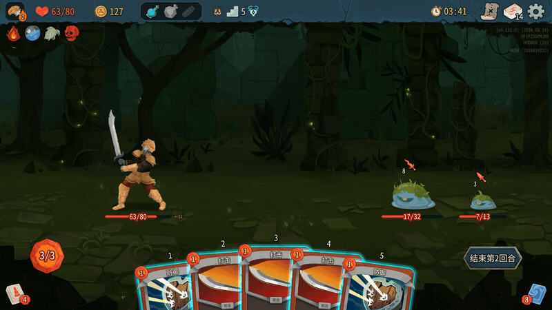
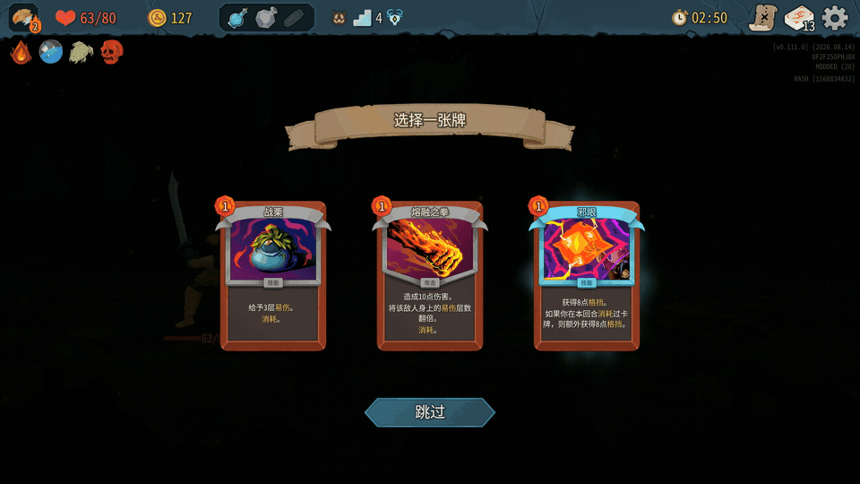
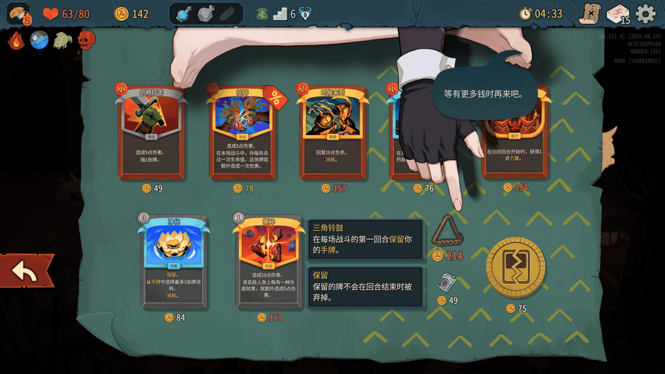

# Touch-STS2

STS1-style touchscreen controls for Slay the Spire 2.

- Drag cards to play, or tap a card to inspect it before choosing a target.
- Keep targeted cards at the lower center while aiming and untargeted cards moving with your finger.
- Confirm rewards, purchases, and other choices with native game buttons.
- Scroll lists without accidentally selecting entries, and hold supported cards to inspect them.
- Target allies through their characters or the party sidebar.
- Use settings translated into the game's current language.

Enable **Touchscreen mode** in the game's input settings. Mouse input follows the same rules while it is enabled; controller input temporarily takes over. **Hold to inspect** and **Touch feedback** can be toggled separately.

The same settings are available through BaseLib and ModConfig when installed. See the [player guide](docs/PLAYTEST.md) for controls and compatibility.

Drag cards and choose targets in combat.

Inspect card rewards before confirming your choice.

Confirm a shop purchase with the native button.

